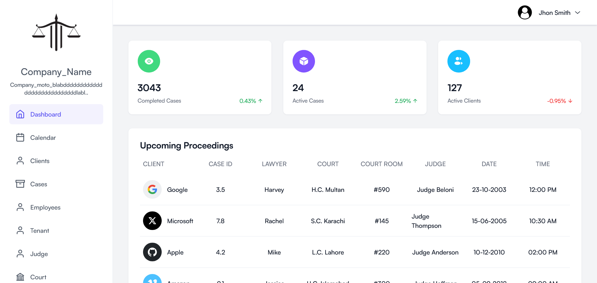
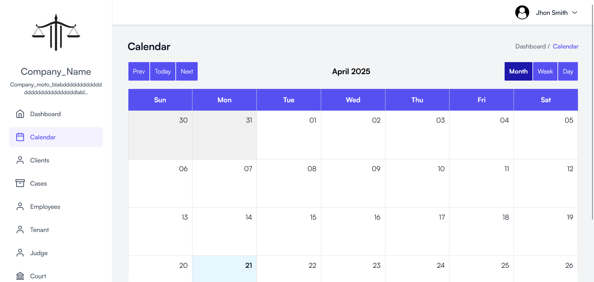
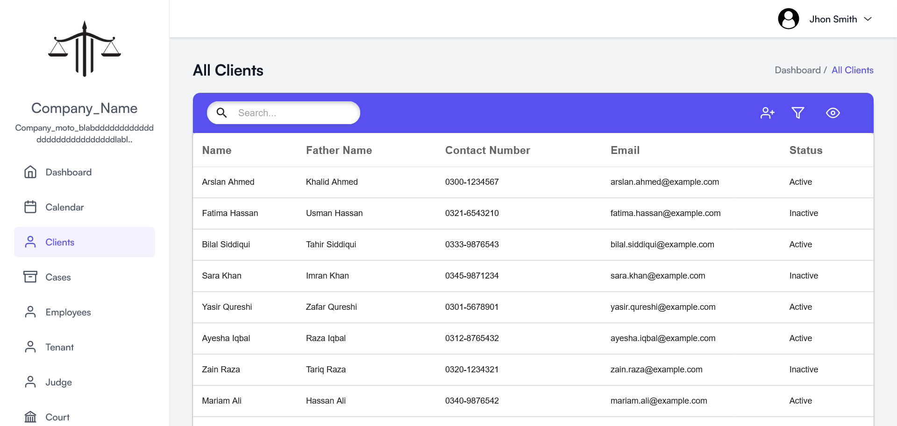
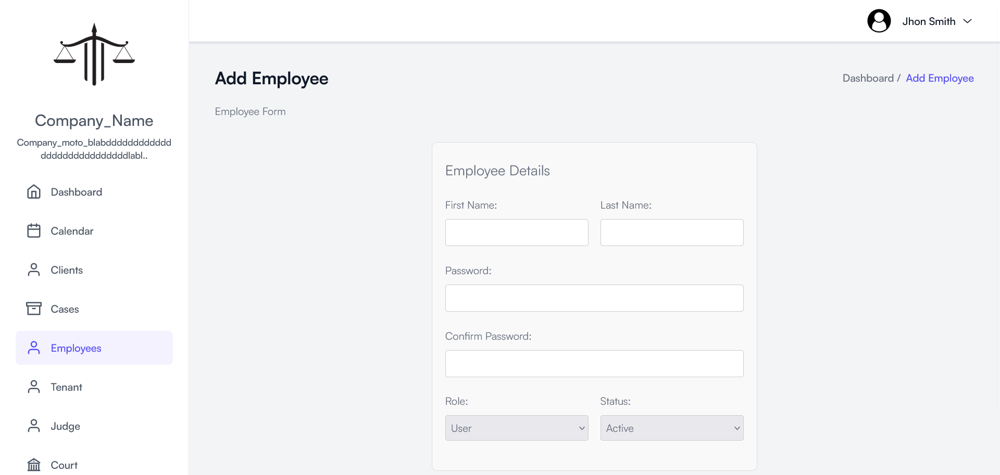
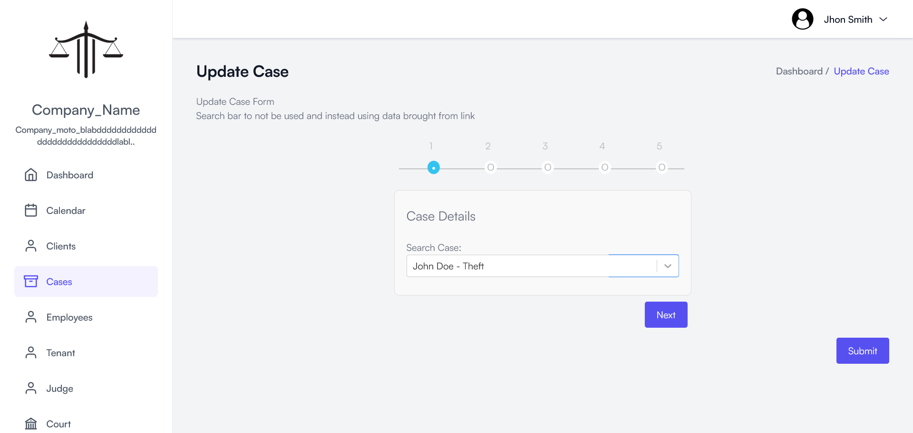
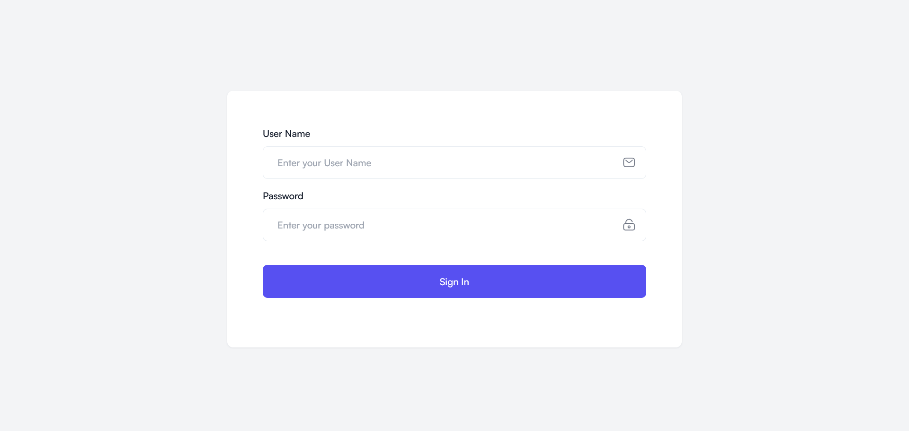
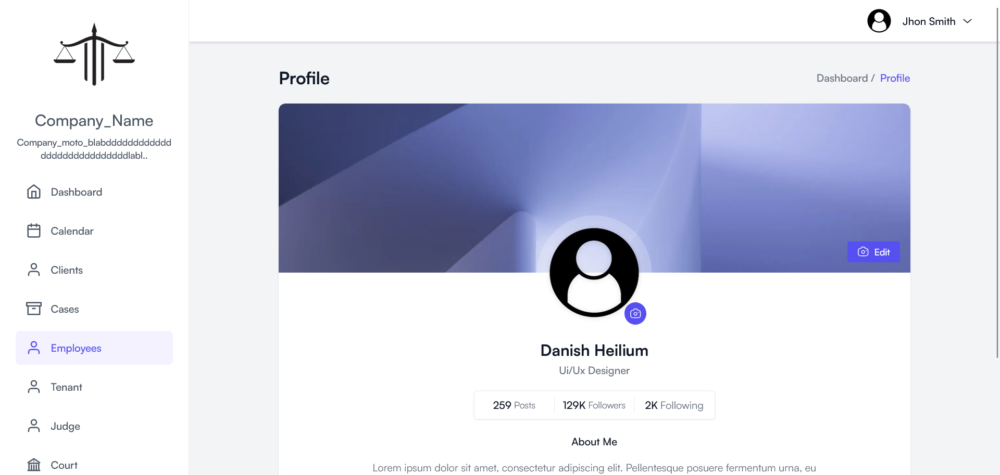
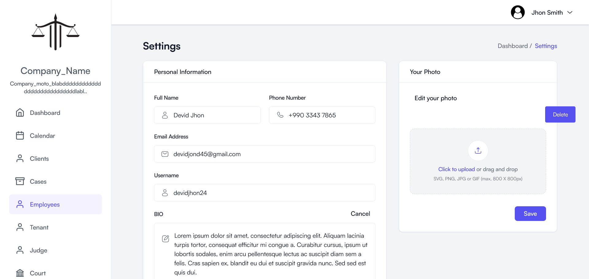

# Lawyer Management System

Frontend for a Lawyer Management System designed for any lawyer or small firm to manage its clients and frontend/assets.

## Features

- **Responsiveness**
- **Calendar**
- **MultiStep Form**
- **Updates Forms**
- **Filters/Search**
- **Profile/Settings**
- **Table Management**

## Known Issues

Deployment Issues with State Communication Problems

## How to Start

```bash

npm i
npm run dev

```

## Screenshots

### Homepage



### Calendar



### Customers



### Add



### Update



### Login



### Profile



### Setting


